#  Expense Tracker

A modern, highly-polished, and feature-rich **Expense Tracker** application built with Flutter, backed by a **Supabase** backend, and state-managed with **Provider** following a strict **MVVM + Service** architecture.

---

## 🚀 Key Features

- **🔐 Secure Authentication**: Integrated with Supabase Auth (Sign In, Sign Up, Password Reset, in-app OTP recovery verification, and Auth Persistence) with built-in retry logic and exponential back-off for transient network issues.
- **📊 Interactive Analytics & Insights**: Drill-down charts powered by `fl_chart` to view expenses, incomes, and net balances (with support for positive/negative values, rounded bar indicators, custom tooltips, and haptic feedback) filterable by date ranges, automatically synchronized with split expenses and personal transactions.
- **🤝 Shared Split Expenses**:
  - **Friends List Feed**: User-wise grouped friends list with balance indicators (`owes you ₹X`, `you owe ₹Y`, `settled up`) and overall position banner.
  - **Friend Detail Screen (`UserSplitDetailPage`)**: Dedicated shared bill timeline with friend summary card, per-person share breakdowns, and unified Settle Up confirmation modal.
  - **Settle Up Payments**: Support Settle Up for both lenders and debtors, logging income settlement transactions when receiving money and expense settlement transactions when paying back.
  - **Hide / Unhide Friends**: Hide friends from the main list via the top-right `AppBar` action on the friend screen. Persisted via `SharedPreferences`, automatically excluded from the Add Split dropdown, and accessible via a low-profile expand/collapse toggle.
  - **Six Split Modes**: `AddSplitPage` supports splitting `equally`, `youOweFull`, `partnerOwesFull`, by `exactAmounts`, by `percentages`, or by `shares` — with live calculation previews.
  - **Two-Section Form**: `AddSplitPage` features card sections for "Transaction Details" and "Split Details" with strict validation before saving.
  - **Transaction & Analytics Integration**: Out-of-pocket split shares and settlements automatically log to personal transactions, updating home feeds and analytics charts in real time.
- **📁 Dynamic Categories Management**: Create, view, edit, and delete custom categories. Features a fluid drag-and-drop reordering interface, single-request batch creation, and database-level user ownership checks.
- **💸 Transaction Ledger**: Log income and expenses with customizable dates, categories, payment methods (UPI or Cash), and descriptions. **Search** transactions by amount or description. **Filter** by multiple categories (multi-select), payment method, transaction type, or date range.
- **💾 Optimistic UI & Smart Caching**: Custom in-memory caching layer with TTL validation, compound filter keys, concurrent request deduplication via `Completer`, and optimistic state updates with rollback in ViewModels to minimize network overhead and ensure instant screen transitions.
- **📈 Analytics Snapshot**: A dedicated `loadAnalyticsSnapshot()` mechanism in `TransactionViewModel` fetches a separate date-filtered dataset for analytics without clobbering the main transaction feed or filters.
- **⚙️ Customizable Settings & Preferences**: Personalize the experience by configuring theme (system/light/dark), haptic feedback, default analytics tab, analytics tab order, and hidden friends — all saved persistently via `SharedPreferences`.
- **🎨 Rich Material 3 Aesthetics**: Tailored dynamic dark & light themes (`#000000` scaffold / `#0A0A0A` surface for dark mode), custom Inter typography (packaged locally to avoid network delays), rounded press highlights (`Clip.antiAlias`), conditional haptic feedback, `AnimatedSwitcher` tab transitions, and tap-to-scroll-to-top gestures.

---

## 📸 Screenshots

| Light Mode | Dark Mode |
|:---:|:---:|
| 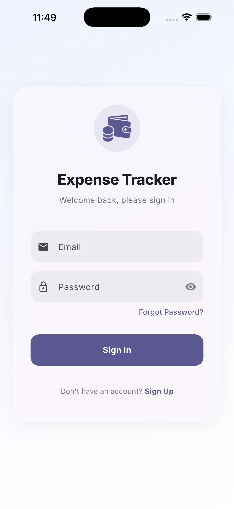 | 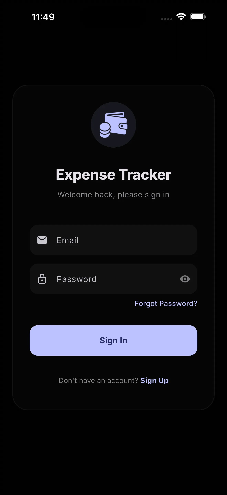 |
| 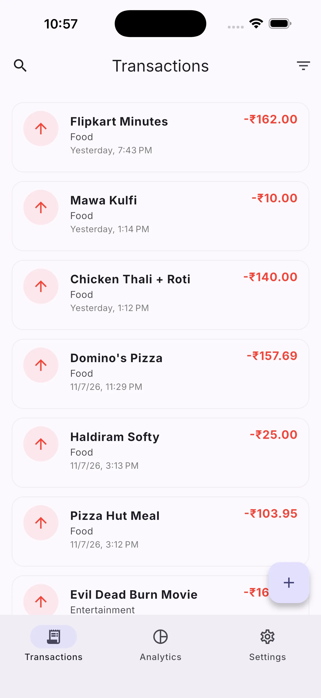 | 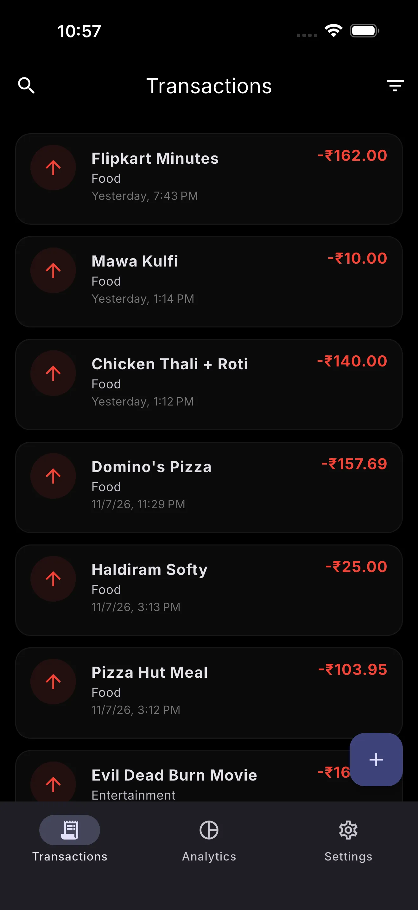 |
| 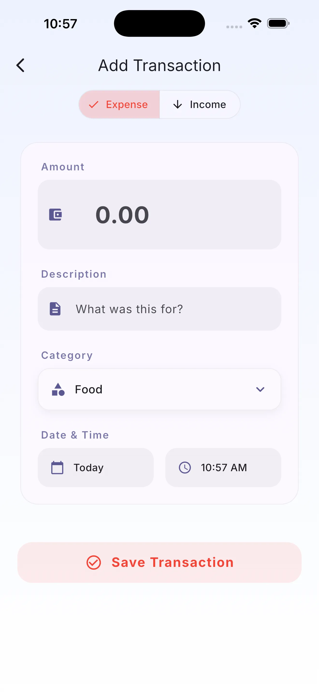 | 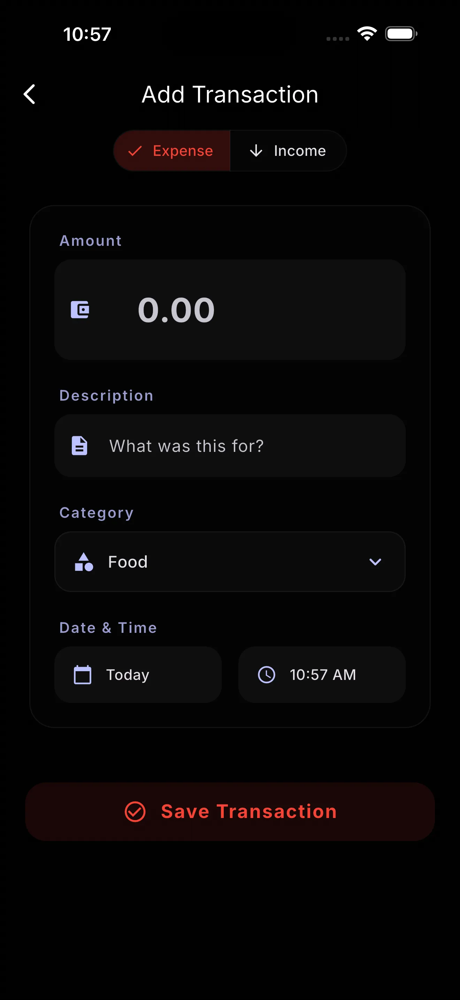 |
| 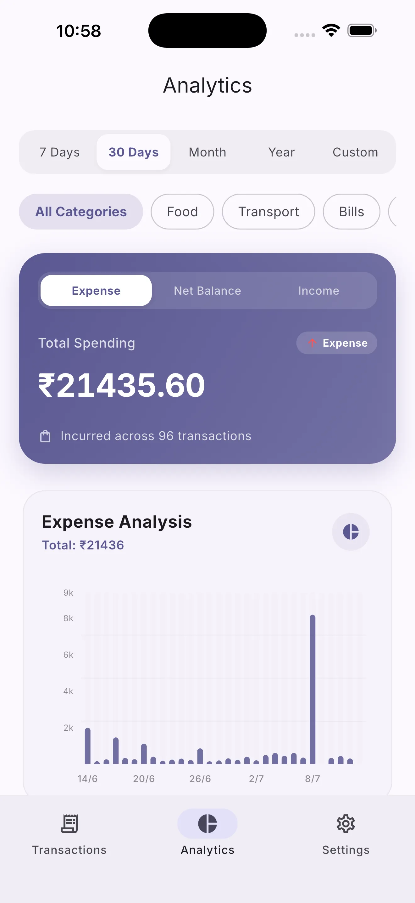 | 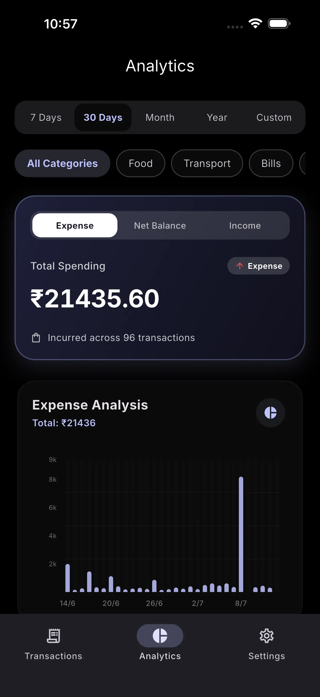 |
| 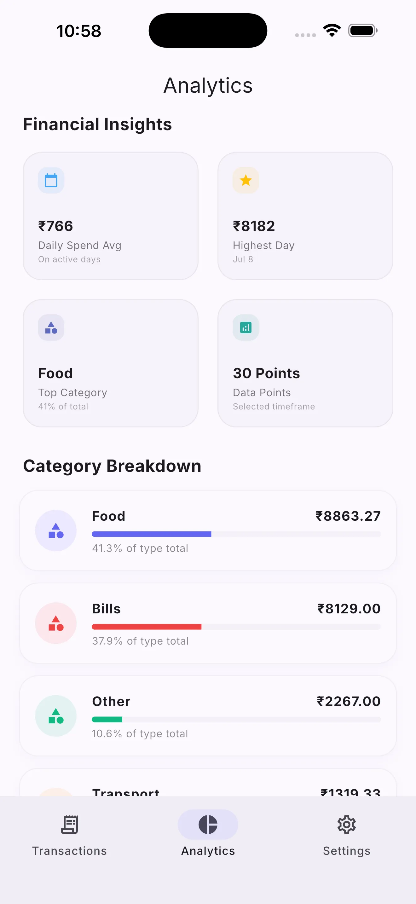 | 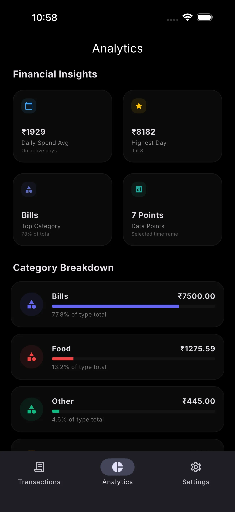 |
| 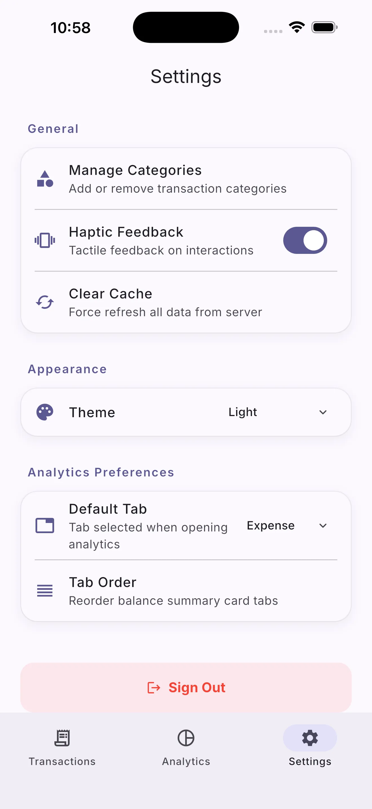 | 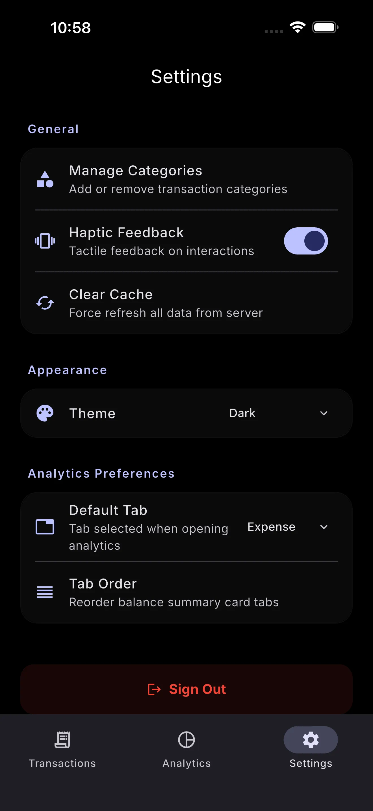 |
| 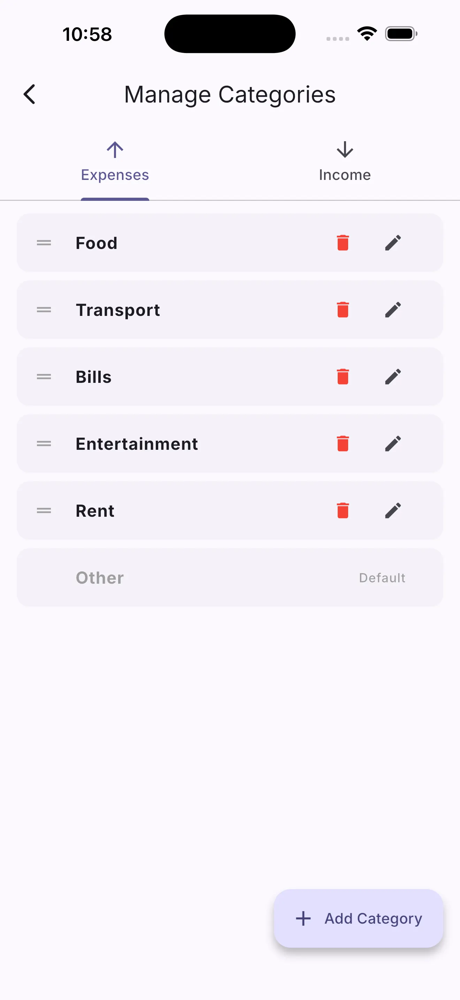 | 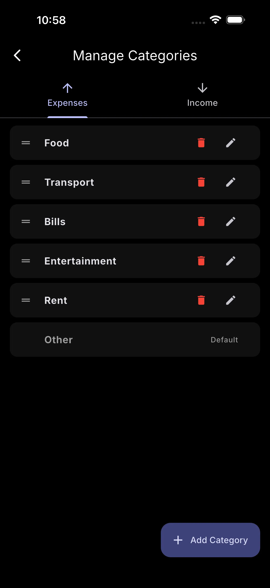 |

---

## 🛠️ Technology Stack & Dependencies

- **Framework**: [Flutter](https://flutter.dev) (Dart SDK `^3.11.0`)
- **Backend & Database**: [Supabase](https://supabase.com) (`supabase_flutter: ^2.12.0`)
- **State Management**: [Provider](https://pub.dev/packages/provider) (`provider: ^6.1.5+1`)
- **Data Visualization**: [FL Chart](https://pub.dev/packages/fl_chart) (`fl_chart: ^1.1.1`)
- **Fonts & Styling**: [Google Fonts](https://pub.dev/packages/google_fonts) (`google_fonts: ^8.0.2` with Inter font loaded locally)
- **Formatting & Localization**: [Intl](https://pub.dev/packages/intl) (`intl: ^0.20.2`)
- **Persistence**: [Shared Preferences](https://pub.dev/packages/shared_preferences) (`shared_preferences: ^2.5.4`)

---

## 🏗️ Architecture (MVVM + Service)

The project adheres strictly to the **Model-View-ViewModel (MVVM)** pattern combined with a **Service Layer**:

```
lib/
├── app/
│   ├── app.dart              # MyApp: MultiProvider + MaterialApp light/dark theme
│   └── supabase_config.dart  # Compile-time credential injection + SupabaseClient accessor
├── models/                   # Pure Dart — no Flutter imports, no business logic
│   ├── category.dart         # CategoryModel (sortWithOtherLast static helper)
│   ├── profile.dart          # ProfileModel (displayName getter)
│   ├── split_expense.dart    # SplitExpenseModel (displayPayer/displayBorrower helpers)
│   └── transaction.dart      # TransactionModel (full CRUD fields + copyWith)
├── services/                 # ONLY layer that imports supabase_flutter
│   ├── auth_service.dart     # Singleton: Supabase Auth + retry/back-off + error mapping
│   └── database_service.dart # Singleton: PostgREST ops, 30s TTL cache, Completer dedup
├── viewmodels/               # ALL business logic lives here — ChangeNotifier state machines
│   ├── auth_viewmodel.dart   # Loading/error flags, recovery mode, session stream
│   ├── category_viewmodel.dart  # CRUD, drag reorder with rollback, seeding, name lists
│   ├── split_viewmodel.dart  # Feed, net balances, settle up, hidden friends; user identity via AuthService
│   ├── theme_viewmodel.dart  # Theme mode, haptics, analytics tab preferences
│   └── transaction_viewmodel.dart  # Feed, filters, search, analytics snapshot, optimistic ops
├── views/                    # UI ONLY — consume ViewModels via Provider/Consumer
│   ├── analytics/
│   │   └── analytics_page.dart   # FL Chart pie + bar, memoized aggregations
│   ├── auth/
│   │   ├── auth_gate.dart         # Routes to LoginPage/HomePage/UpdatePasswordPage
│   │   ├── forgot_password_page.dart
│   │   ├── login_page.dart
│   │   └── update_password_page.dart
│   ├── home/
│   │   ├── home_page.dart         # Bottom nav, AnimatedSwitcher tab transitions
│   │   └── widgets/
│   │       ├── filter_bottom_sheet.dart
│   │       └── transaction_list.dart  # Infinite scroll-load-more pagination
│   ├── settings/
│   │   ├── manage_categories_page.dart
│   │   └── settings_page.dart
│   ├── split/
│   │   ├── add_split_page.dart    # 6 split modes, Who Paid selector, live previews; user identity via SplitViewModel
│   │   ├── split_page.dart
│   │   └── user_split_detail_page.dart
│   └── transaction/
│       └── add_transaction_page.dart
├── widgets/
│   └── app_dropdown.dart     # AppDropdown<T> and AppDropdownButton<T>
└── utils/
    ├── date_formatter.dart   # Relative date labels (Today/Yesterday)
    ├── exceptions.dart       # AppException hierarchy (Data/Auth/Network/Unauthenticated)
    └── haptics.dart          # AppHaptics: conditional haptic helpers
```

---

## 💾 Caching & Sync Strategy

The `DatabaseService` uses an **in-memory cache** combined with query safeguards to prevent unnecessary PostgREST calls and ensure fluid navigation:
- **TTL (Time to Live)**: Cache is valid for `30 seconds`.
- **Compound Cache Key**: The cache uses a composite key generated from active filters (`type`, `categories` list, `paymentMethod`, `startDate`, `endDate`).
- **Cache Invalidation**: Any database mutation (insert, update, delete, reordering) invalidates the cache immediately to force a sync.
- **Request Deduplication**: A concurrency guard prevents concurrent identical network requests.
- **Optimistic UI**: Transactions and split expense statuses are updated locally first, recalculating stats immediately, avoiding blocking spinners.

---

## ⚠️ Robust Exception Handling

All services catch raw network and database exceptions, mapping them to safe typed `AppException` subclasses (`lib/utils/exceptions.dart`):
- `UnauthenticatedException`
- `DataException`
- `AppAuthException`
- `NetworkException`

ViewModels catch these exceptions and display user-friendly error bars without exposing raw DB stack traces.

---

## 📊 Database Schema

### 1. `transactions`
- `id` (UUID, Primary Key) - Auto-generated
- `user_id` (UUID, Foreign Key) - References Supabase Auth User
- `amount` (Numeric) - Decimal transaction value
- `type` (Text) - `'expense'` or `'income'`
- `category` (Text) - Associated category name
- `description` (Text, Optional) - Optional memo/note
- `payment_method` (Text) - `'upi'` or `'cash'` (default `'upi'`)
- `transaction_date` (Timestamptz) - Date when transaction occurred
- `created_at` (Timestamptz) - Server-side creation timestamp

### 2. `categories`
- `id` (UUID, Primary Key) - Auto-generated
- `user_id` (UUID, Foreign Key) - References Supabase Auth User
- `name` (Text) - Display label of the category
- `type` (Text) - `'expense'` or `'income'`
- `order_index` (Integer) - Order ranking for reorderable list views
- `created_at` (Timestamptz) - Server-side creation timestamp

### 3. `split_expenses`
- `id` (UUID, Primary Key) - Auto-generated
- `payer_id` (UUID, Foreign Key) - References `profiles(id)`
- `borrower_id` (UUID, Foreign Key) - References `profiles(id)`
- `amount` (Numeric) - Per-person debt share
- `total_amount` (Numeric) - Total bill amount
- `description` (Text) - Description/memo for the split expense
- `category` (Text) - Associated category (default `'General'`)
- `status` (Text) - `'pending'` or `'settled'`
- `expense_date` (Timestamptz) - Date when the split expense occurred
- `created_at` (Timestamptz) - Server-side creation timestamp

### 4. `profiles`
- `id` (UUID, Primary Key) - Maps to Supabase Auth User ID
- `email` (Text) - User email address
- `name` (Text, Optional) - User display name
- `created_at` (Timestamptz) - Server-side creation timestamp

---

## 🏁 Getting Started

### Prerequisites

- [Flutter SDK](https://flutter.dev/docs/get-started/install) (version `>= 3.11.0`)
- Android Studio / VS Code with Flutter extensions
- A physical device or emulator

### Installation & Run

1. **Clone the repository**:
   ```bash
   git clone <repository_url>
   cd expense_tracker
   ```

2. **Get dependencies**:
   ```bash
   flutter pub get
   ```

3. **Verify the environment configuration**:
   The app resolves Supabase credentials at compile-time via `--dart-define` parameters. For convenience, it falls back to development defaults. You can specify yours when running or building:
   ```bash
   flutter run \
     --dart-define=SUPABASE_URL=https://your-project.supabase.co \
     --dart-define=SUPABASE_ANON_KEY=your-anon-key
   ```
   Or place them in a `.env.json` and run:
   ```bash
   flutter run --dart-define-from-file=.env.json
   ```

4. **Run the app**:
   ```bash
   flutter run
   ```
